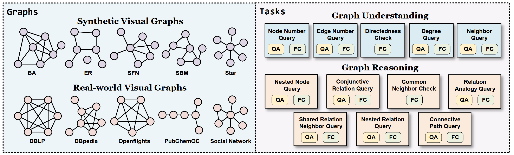
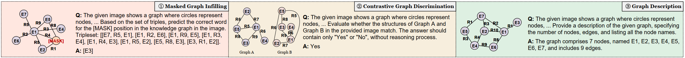

# Benchmarking and Improving Large Vision-Language Models for Fundamental Visual Graph Understanding and Reasoning

This repository contains the official implementation of our paper, **Benchmarking and Improving Large Vision-Language Models for Fundamental Visual Graph Understanding and Reasoning**.

## VGCURE Benchamrk



The **complete data** of VGCure can be found in [**🤗Huggingface**](https://huggingface.co/datasets/AAAndyZ/VGCure) and [**Google Driver**](https://drive.google.com/drive/folders/1WF3KyYTh3flhICzexoqHvV7OzWmxt1aB?usp=sharing).

We provide 10 visual graphs as references in this repository [for each graph structure in VGCure](VGCure/images/) and [for each task in MCDGraph](MCDGraph/images/).
In addition, we also provide graphs with different visual styles drawn by `networkx` and `matplotlib` [here](VGCure/images_networkx/) for reference.

## MCDGRAPH Framework



### Dataset

The **complete data** of MCDGraph can be found in [**🤗Huggingface**](https://huggingface.co/datasets/AAAndyZ/VGCure) and [**Google Driver**](https://drive.google.com/drive/folders/1WF3KyYTh3flhICzexoqHvV7OzWmxt1aB?usp=sharing).

### Checkpoints
| Models             |    URL   |
|--------------------|:--------:|
| Qwen2VL-MCDGraph   | [**🤗Huggingface**](https://huggingface.co/AAAndyZ/Qwen2VL_MCDGraph)|
| InternVL2-MCDGraph | [**🤗Huggingface**](https://huggingface.co/AAAndyZ/InternVL2_MCDGraph)|


## Citation
Please cite our paper if you use VGCURE or MCDGRAPH we provided in your work:
```
@inproceedings{zhu-etal-2025-benchmarking,
  title={Benchmarking and improving large vision-language models for fundamental visual graph understanding and reasoning},
  author={Zhu, Yingjie and Bai, Xuefeng and Chen, Kehai and Xiang, Yang and Yu, Jun and Zhang, Min},
  booktitle={Proceedings of the 63nd Annual Meeting of the Association for Computational Linguistics (Volume 1: Long Papers)},
  year = {2025},
  publisher = {Association for Computational Linguistics},
}
```
